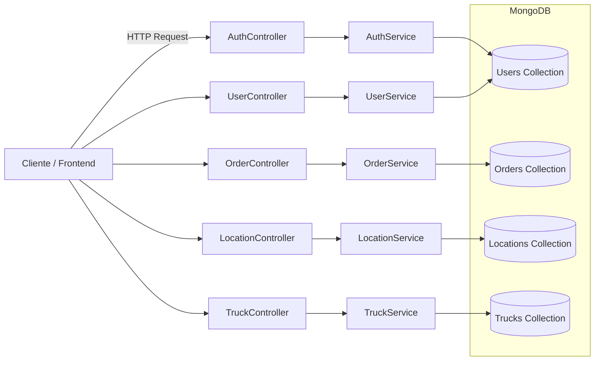

# Backend Test API

Proyecto backend desarrollado con NestJS y MongoDB. Esta API permite gestionar un sistema de órdenes de transporte, incluyendo usuarios, camiones, localizaciones y órdenes.

- **Autenticación** con JWT (login/registro de usuarios).
- **Gestión de usuarios**: crear, obtener, actualizar y eliminar.
- **Gestión de camiones**: CRUD completo.
- **Gestión de localizaciones**: CRUD completo.
- **Gestión de órdenes**: creación, consulta, actualización de estado y eliminación.

## Abordaje del desarrollo

- Inicié el proyecto con **NestJS** porque ofrece una arquitectura modular y escalable.
- Definí los **módulos principales** (Auth, Users, Trucks, Locations, Orders) para mantener la separación de responsabilidades.
- Implementé **variables de entorno** para credenciales, claves externas y configuraciones del servidor.
- Usé **MongoDB con Mongoose** para modelar los datos por requerimiento del proyecto.
- Implementé **autenticación con JWT** usando Passport, estrategias locales y guards.
- Usé de bcrypt para hash de contraseñas, JWT para autenticación, para evitar almacenar contraseñas en texto plano.
- Añadí **validaciones** en los DTOs con `class-validator` y `class-transformer`.
- Opté por agregar **Docker** para que la base de datos y la app se puedan levantar fácilmente en cualquier entorno.
- Documenté los **endpoints** en este README y probé cada uno con herramientas como **Postman** o **cURL**.

## Retos y soluciones

- **Integración con Google Places API**
  - Reto: dificultad inicial en el uso y autenticación.
  - Solución: lectura de la documentación oficial.

- **Manejo de ObjectId en MongoDB**
  - Reto: los ObjectId se guardaban como cadenas de texto.
  - Solución: implementé `ValidationPipe` con `transform` para convertir correctamente los valores en `ObjectId`.

- **Consultas con datos relacionados**
  - Reto: mostrar órdenes con campos de usuarios, localizaciones y camiones "limpios" (sin datos sensibles como contraseñas o datos irrelevantes como claves de Places API).
  - Solución: creé un **aggregation pipeline** con `$lookup` y `$project` para poblar la información necesaria.

## Próximos pasos / mejoras

- Añadir paginación a las consultas de cada uno, en especial órdenes.
- Añadir roles y permisos a los usuarios.
- Implementar mejores unit tests con Jest para los servicios y controladores.

---



# Índice

- [Requisitos](#requisitos)
- [Dependencias](#dependencias)
- [Instalación](#instalación)
- [Configuración](#configuración)
  - [1. Ejecución local](#1-ejecución-local)
  - [2. Ejecución con Docker](#2-ejecución-con-docker)

- [Endpoints de Autenticación](#endpoints-de-autenticación)
  - [Registrar usuario](#registrar-usuario)
  - [Login de usuario](#login-de-usuario)
- [Uso del token](#uso-del-token)
- [Flujo de autenticación](#flujo-de-autenticación)

- [Endpoints Usuarios](#endpoints-usuarios)
  - [Crear usuario](#crear-usuario)
  - [Obtener usuario por ID](#obtener-usuario-por-id)
  - [Actualizar usuario](#actualizar-usuario)
  - [Eliminar usuario](#eliminar-usuario)

- [Endpoints de Camiones (Truck)](#endpoints-de-camiones-truck)
  - [Crear camión](#crear-camión)
  - [Listar camiones](#listar-camiones)
  - [Obtener camión por ID](#obtener-camión-por-id)
  - [Actualizar camión](#actualizar-camión)
  - [Eliminar camión](#eliminar-camión)

- [Endpoints de Localización (Location)](#endpoints-de-localizacion-location)
  - [Crear localización](#crear-localización)
  - [Listar localizaciones](#listar-localizaciones)
  - [Obtener localización por ID](#obtener-localización-por-id)
  - [Actualizar localización](#actualizar-localización)
  - [Eliminar localización](#eliminar-localización)

- [Endpoints de órdenes (Order)](#endpoints-de-ordenes-order)
  - [Crear una orden](#crear-una-orden)
  - [Listar todas las órdenes](#listar-todas-las-órdenes)
  - [Obtener una orden por ID](#obtener-una-orden-por-id)
  - [Actualizar el **status** de una orden](#actualizar-el-status-de-una-orden)
  - [Actualizar una orden](#actualizar-una-orden)
  - [Eliminar una orden](#eliminar-una-orden)

## Requisitos

- Node.js >= 18
- MongoDB >= 5
- pnpm (o npm/yarn)

## Dependencias

**Base de datos**

- [**Mongoose**](https://mongoosejs.com/) → ODM para interactuar con MongoDB.

**Validación**

- [**class-validator**](https://github.com/typestack/class-validator) → Validación de DTOs.

**Seguridad y autenticación**

- [**bcrypt**](https://www.npmjs.com/package/bcrypt) → Hash y comparación de contraseñas.
- [**@nestjs/jwt**](https://docs.nestjs.com/security/authentication#jwt-functionality), [**passport**](http://www.passportjs.org/), [**passport-jwt**](http://www.passportjs.org/packages/passport-jwt/), [**passport-local**](http://www.passportjs.org/packages/passport-local/) → Autenticación con JWT y estrategia local.

**Configuración**

- [**@nestjs/config**](https://docs.nestjs.com/techniques/configuration) → Manejo de variables de entorno.

**Integración con APIs externas**

- [**@nestjs/axios**](https://docs.nestjs.com/techniques/http-module) → Cliente HTTP para consumo de APIs (ej. Google Places API).
- [**Google Places API**](https://developers.google.com/maps/documentation/places/web-service/overview) → Obtención de direcciones y coordenadas (`GOOGLE_API_KEY`).

## Instalación

```sh
pnpm install
```

## Configuración

### 1. Ejecución local

#### Requisitos

- [Node.js](https://nodejs.org/) >= 18
- [npm](https://www.npmjs.com/) o [pnpm](https://pnpm.io/)
- [MongoDB](https://www.mongodb.com/) >= 6.0
- Acceso a `mongosh` para crear usuarios y bases de datos

Configura las variables de entorno en `.env` en la raíz del proyecto:

```
# NestJS
PORT=3000

# MongoDB
DATABASE_HOST=db:27017
DATABASE_USERNAME=user_db
DATABASE_PASSWORD=password_db
DATABASE_NAME=test_db

# Google API
GOOGLE_API_KEY=tu_clave_api

# JWT
JWT_SECRET=test_secret_key

```

#### Configuración de MongoDB

Antes de correr la aplicación, crea un usuario para tu base de datos `test_db` usando `mongosh`:

```bash
# Conéctate a mongosh
mongosh

# Cambia a la base de datos que usarás
use test_db

# Crea un usuario con permisos de lectura y escritura
db.createUser({
  user: "user_db",
  pwd: "password_db",
  roles: [
    { role: "readWrite", db: "test_db" }
  ]
})
```

### 2. Ejecución con Docker

#### Requisitos

- [Docker](https://docs.docker.com/get-docker/) >= 20.x
- [Docker Compose](https://docs.docker.com/compose/) >= 2.x

```bash
# Desde la raíz del proyecto ve a la carpeta docker
cd docker

# Levanta los servicios con Docker Compose
docker-compose up --build

# La API estará disponible en:
http://localhost:3000

```

## Endpoints de Autenticación

La API permite registrar usuarios y autenticarlos mediante JWT.

### Registrar usuario

`POST /auth/register`

**Body:**

```json
{
  "email": "ejemplo@mail.com",
  "password": "Ejemplo1"
}
```

**Respuesta exitosa:**

```json
{
  "email": "ejemplo@mail.com",
  "_id": "68b0d0afd8bc5194b08e0ed7",
  "createdAt": "2025-08-28T21:57:03.599Z",
  "updatedAt": "2025-08-28T21:57:03.599Z",
  "__v": 0
}
```

**Errores:**

- Email duplicado:
  ```json
  {
    "message": "El usuario ya se encuentra registrado",
    "error": "Bad Request",
    "statusCode": 400
  }
  ```
- Email inválido o vacío:
  ```json
  {
    "message": ["email must be an email", "email should not be empty"],
    "error": "Bad Request",
    "statusCode": 400
  }
  ```
- Contraseña vacía:
  ```json
  {
    "message": ["password should not be empty"],
    "error": "Bad Request",
    "statusCode": 400
  }
  ```

---

### Login de usuario

`POST /auth/login`

**Body:**

```json
{
  "email": "ejemplo@mail.com",
  "password": "Ejemplo1"
}
```

**Respuesta exitosa:**

```json
{
  "token_JWT": "eyJhbGciOiJIUzI1NiIsInR5cCI6IkpXVCJ9..."
}
```

**Errores:**

- Credenciales incorrectas:
  ```json
  {
    "message": "Unauthorized",
    "statusCode": 401
  }
  ```

## Uso del token

Incluye el token JWT en el header para acceder a los endpoints protegidos:

```
Authorization: Bearer <token>
```

**Error si el token es inválido o fue enviado en el header:**

```json
{
  "statusCode": 401,
  "message": "Unauthorized"
}
```

## Flujo de autenticación

1. **Registro:** El usuario se registra con email y contraseña. La contraseña se almacena hasheada.
2. **Login:** El usuario envía email y contraseña, recibe un token JWT si las credenciales son correctas.
3. **Acceso:** Usa el token JWT para acceder a los endpoints protegidos del CRUD de usuarios, camiones, ubicaciones y ordenes.

## Endpoints Usuarios

Todos los endpoints requieren autenticación JWT.

### Crear usuario

`POST /user`

**Body:**

```json
{
  "email": "ejemplo@mail.com",
  "password": "Ejemplo1"
}
```

**Respuesta exitosa:**

```json
{
  "email": "ejemplo@mail.com",
  "_id": "68b0d0afd8bc5194b08e0ed7",
  "createdAt": "2025-08-28T21:57:03.599Z",
  "updatedAt": "2025-08-28T21:57:03.599Z",
  "__v": 0
}
```

**Errores:**

- Email duplicado:
  ```json
  {
    "message": "El usuario ya se encuentra registrado",
    "error": "Bad Request",
    "statusCode": 400
  }
  ```
- Email inválido o vacío:
  ```json
  {
    "message": ["email must be an email", "email should not be empty"],
    "error": "Bad Request",
    "statusCode": 400
  }
  ```
- Contraseña vacía:
  ```json
  {
    "message": ["password should not be empty"],
    "error": "Bad Request",
    "statusCode": 400
  }
  ```

### Listar usuarios

`GET /user`

**Respuesta:**

```json
[
  {
    "email": "ejemplo@mail.com"
  },
  {
    "email": "otro@mail.com"
  }
]
```

### Obtener usuario por ID

`GET /user/:id`

**Respuesta exitosa:**

```json
{
  "_id": "68b0d0afd8bc5194b08e0ed7",
  "email": "ejemplo@mail.com",
  "createdAt": "2025-08-28T21:57:03.599Z",
  "updatedAt": "2025-08-28T21:57:03.599Z",
  "__v": 0
}
```

**Error:**

```json
{
  "message": "Usuario con id 68b0d0afd8bc5194b08e0ed7 no encontrado",
  "error": "Not Found",
  "statusCode": 404
}
```

### Actualizar usuario

`PATCH /user/:id`

**Body:**

```json
{
  "email": "nuevo@mail.com"
}
```

**Respuesta exitosa:**

```json
{
  "_id": "68b0d0afd8bc5194b08e0ed7",
  "email": "nuevo@mail.com",
  "createdAt": "2025-08-28T21:57:03.599Z",
  "updatedAt": "2025-08-28T22:00:00.000Z",
  "__v": 0
}
```

**Error:**

```json
{
  "message": "Usuario con id 68b0d0afd8bc5194b08e0ed7 no encontrado",
  "error": "Not Found",
  "statusCode": 404
}
```

### Eliminar usuario

`DELETE /user/:id`

**Respuesta exitosa:**  
Código HTTP 204 (Sin contenido)

**Error:**

```json
{
  "message": "Usuario con id 68b0d0afd8bc5194b08e0ed7 no encontrado",
  "error": "Not Found",
  "statusCode": 404
}
```

## Endpoints de Camiones (Truck)

Todos los endpoints requieren autenticación JWT.

### Crear camión

`POST /truck`

**Body:**

```json
{
  "user": "68b0d0afd8bc5194b08e0ed7",
  "year": "2022",
  "color": "Rojo",
  "plates": "ABC123"
}
```

**Respuesta exitosa:**

```json
{
  "_id": "68b0d0afd8bc5194b08e0ed8",
  "user": "68b0d0afd8bc5194b08e0ed7",
  "year": "2022",
  "color": "Rojo",
  "plates": "ABC123",
  "createdAt": "2025-08-31T21:57:03.599Z",
  "updatedAt": "2025-08-31T21:57:03.599Z",
  "__v": 0
}
```

### Listar camiones

`GET /truck`

**Respuesta:**

```json
[
  {
    "_id": "68b0d0afd8bc5194b08e0ed8",
    "user": "68b0d0afd8bc5194b08e0ed7",
    "year": "2022",
    "color": "Rojo",
    "plates": "ABC123"
  },
  {
    "_id": "68b0d0afd8bc5194b08e0ed9",
    "user": "68b0d0afd8bc5194b08e0ed7",
    "year": "2021",
    "color": "Azul",
    "plates": "XYZ789"
  }
]
```

### Obtener camión por ID

`GET /truck/:id`

**Respuesta exitosa:**

```json
{
  "_id": "68b0d0afd8bc5194b08e0ed8",
  "user": "68b0d0afd8bc5194b08e0ed7",
  "year": "2022",
  "color": "Rojo",
  "plates": "ABC123",
  "createdAt": "2025-08-31T21:57:03.599Z",
  "updatedAt": "2025-08-31T21:57:03.599Z",
  "__v": 0
}
```

**Error:**

```json
{
  "message": "Camión con id 68b0d0afd8bc5194b08e0ed8 no encontrado",
  "error": "Not Found",
  "statusCode": 404
}
```

### Actualizar camión

`PATCH /truck/:id`

**Body:**

```json
{
  "color": "Negro",
  "plates": "DEF456"
}
```

**Respuesta exitosa:**

```json
{
  "_id": "68b0d0afd8bc5194b08e0ed8",
  "user": "68b0d0afd8bc5194b08e0ed7",
  "year": "2022",
  "color": "Negro",
  "plates": "DEF456",
  "createdAt": "2025-08-31T21:57:03.599Z",
  "updatedAt": "2025-08-31T22:00:00.000Z",
  "__v": 0
}
```

**Error:**

```json
{
  "message": "Camión con id 68b0d0afd8bc5194b08e0ed8 no encontrado",
  "error": "Not Found",
  "statusCode": 404
}
```

### Eliminar camión

`DELETE /truck/:id`

**Respuesta exitosa:**  
Código HTTP 204 (Sin contenido)

**Error:**

```json
{
  "message": "Camión con id 68b0d0afd8bc5194b08e0ed8 no encontrado",
  "error": "Not Found",
  "statusCode": 404
}
```

## Endpoints de Localización (Location)

Todos los endpoints requieren autenticación JWT.

### Crear localización

`POST /location`

**Body:**

```json
{
  "place_id": "ChIJiRp93iEC0oURvJVqErpVVHw"
}
```

**Respuesta exitosa:**

```json
{
  "_id": "68b0d0afd8bc5194b08e0ed8",
  "place_id": "ChIJiRp93iEC0oURvJVqErpVVHw",
  "address": "San Isidro 44, Reforma Soc, Miguel Hidalgo, 11650 Ciudad de México, CDMX, Mexico",
  "latitude": 19.433681,
  "longitude": -99.2121884,
  "createdAt": "2025-08-31T21:57:03.599Z",
  "updatedAt": "2025-08-31T21:57:03.599Z",
  "__v": 0
}
```

**Errores:**

- Place ID inválido:
  ```json
  {
    "message": "El place_id proporcionado no es válido.",
    "error": "Bad Request",
    "statusCode": 400
  }
  ```
- Place ID duplicado:
  ```json
  {
    "message": "La locación ya se encuentra registrada",
    "error": "Bad Request",
    "statusCode": 400
  }
  ```
- Falta la API Key:
  ```json
  {
    "message": "Google API Key no está definida en las variables de entorno.",
    "error": "Internal Server Error",
    "statusCode": 500
  }
  ```

### Listar localizaciones

`GET /location`

**Respuesta:**

```json
[
  {
    "_id": "68b0d0afd8bc5194b08e0ed8",
    "place_id": "ChIJN1t_tDeuEmsRUsoyG83frY4",
    "address": "5 Sydney Ave, Sydney NSW 2000, Australia",
    "latitude": -33.867487,
    "longitude": 151.20699
  },
  {
    "_id": "68b0d0afd8bc5194b08e0ed9",
    "place_id": "ChIJLfySpTOuEmsRsc_JfJtljdc",
    "address": "1 Martin Pl, Sydney NSW 2000, Australia",
    "latitude": -33.86882,
    "longitude": 151.209296
  }
]
```

### Obtener localización por ID

`GET /location/:id`

**Respuesta exitosa:**

```json
{
  "_id": "68b0d0afd8bc5194b08e0ed8",
  "place_id": "ChIJN1t_tDeuEmsRUsoyG83frY4",
  "address": "5 Sydney Ave, Sydney NSW 2000, Australia",
  "latitude": -33.867487,
  "longitude": 151.20699,
  "createdAt": "2025-08-31T21:57:03.599Z",
  "updatedAt": "2025-08-31T21:57:03.599Z",
  "__v": 0
}
```

**Error:**

```json
{
  "message": "Localización con id 68b0d0afd8bc5194b08e0ed8 no encontrada",
  "error": "Not Found",
  "statusCode": 404
}
```

### Actualizar localización

`PATCH /location/:id`

**Body:**

```json
{
  "place_id": "ChIJGQkBCFIAzoURlLaQUWnuYZc"
}
```

**Respuesta exitosa:**

```json
{
  "_id": "68b0d0afd8bc5194b08e0ed8",
  "place_id": "ChIJGQkBCFIAzoURlLaQUWnuYZc",
  "address": "Calz. de Tlalpan 3465, Sta. Úrsula Coapa, Coyoacán, 04650 Ciudad de México, CDMX, Mexico",
  "latitude": 19.3028607,
  "longitude": -99.1505277,
  "createdAt": "2025-08-31T21:57:03.599Z",
  "updatedAt": "2025-08-31T21:57:03.599Z",
  "__v": 0
}
```

**Error:**

```json
{
  "message": "Localización con id 68b0d0afd8bc5194b08e0ed8 no encontrada",
  "error": "Not Found",
  "statusCode": 404
}
```

### Eliminar localización

`DELETE /location/:id`

**Respuesta exitosa:**  
Código HTTP 204 (Sin contenido)

**Error:**

```json
{
  "message": "Localización con id 68b0d0afd8bc5194b08e0ed8 no encontrada",
  "error": "Not Found",
  "statusCode": 404
}
```

## Endpoints de ordenes (Order)

Permiten administrar órdenes de transporte, incluyendo información del usuario, camión y ubicaciones (`pickup` y `dropoff`).  
Todos los endpoints están protegidos por **JWT** y requieren autenticación.

### Crear una orden

`POST /order`

Crea una nueva orden asociada a un usuario, camión y ubicaciones opcionales.

**Body:**

```json
{
  "user": "64f4c6e1c0a4de1234567890",
  "truck": "64f4c6e1c0a4de0987654321",
  "pickup": "64f4c6e1c0a4de1122334455",
  "dropoff": "64f4c6e1c0a4de5566778899"
}
```

**Respuesta exitosa:**

```json
{
  "_id": "6501c6e1c0a4de9988776655",
  "status": "created",
  "user": "64f4c6e1c0a4de1234567890",
  "truck": "64f4c6e1c0a4de0987654321",
  "pickup": "64f4c6e1c0a4de1122334455",
  "dropoff": "64f4c6e1c0a4de5566778899",
  "createdAt": "2025-08-31T18:30:00.000Z",
  "updatedAt": "2025-08-31T18:30:00.000Z",
  "__v": 0
}
```

**Errores:**

- IDs no válidos:

  ```json
  {
    "statusCode": 400,
    "message": [
      "user must be a valid ObjectId",
      "truck must be a valid ObjectId"
    ],
    "error": "Bad Request"
  }
  ```

### Listar todas las órdenes

`GET /order`

Obtiene todas las órdenes registradas.

**Respuesta exitosa:**

```json
[
  {
    "_id": "6501c6e1c0a4de9988776655",
    "status": "created",
    "user": "64f4c6e1c0a4de1234567890",
    "truck": "64f4c6e1c0a4de0987654321",
    "pickup": "64f4c6e1c0a4de1122334455",
    "dropoff": "64f4c6e1c0a4de5566778899"
  }
]
```

### Obtener una orden por ID

`GET /order/:id`

**Ejemplo:**

```http
GET /order/6501c6e1c0a4de9988776655
```

**Respuesta exitosa:**

```json
{
  "_id": "6501c6e1c0a4de9988776655",
  "status": "created",
  "user": {
    "_id": "64f4c6e1c0a4de1234567890",
    "email": "user@example.com"
  },
  "truck": {
    "_id": "64f4c6e1c0a4de0987654321",
    "year": 2022,
    "color": "blue",
    "plates": "ABC-1234"
  },
  "pickup": {
    "_id": "64f4c6e1c0a4de1122334455",
    "address": "Av. Reforma 123, CDMX"
  },
  "dropoff": {
    "_id": "64f4c6e1c0a4de5566778899",
    "address": "Calz. Tlalpan 456, CDMX"
  }
}
```

**Error:**

- No encontrado:

  ```json
  {
    "statusCode": 404,
    "message": "Orden con id 6501c6e1c0a4de9988776655 no encontrada",
    "error": "Not Found"
  }
  ```

- IDs no válidos:
  ```json
  {
    "statusCode": 400,
    "message": "Cast to ObjectId failed for value \"abc\" at path \"_id\"",
    "error": "Bad Request"
  }
  ```

### Actualizar el **status** de una orden

`PATCH /order/:id/status`

Estados posibles:

- `created`
- `in transit`
- `completed`

**Body:**

```json
{
  "status": "in transit"
}
```

**Respuesta exitosa:**

```json
{
  "_id": "6501c6e1c0a4de9988776655",
  "status": "in transit",
  "user": "64f4c6e1c0a4de1234567890",
  "truck": "64f4c6e1c0a4de0987654321",
  "pickup": "64f4c6e1c0a4de1122334455",
  "dropoff": "64f4c6e1c0a4de5566778899"
}
```

**Error:**

- No encontrada:
  ```json
  {
    "statusCode": 404,
    "message": "Orden con id 6501c6e1c0a4de1111111111 no encontrada",
    "error": "Not Found"
  }
  ```
- Estatus inválido:
  ```json
  {
    "statusCode": 400,
    "message": "Estatus inválido: pending",
    "error": "Bad Request"
  }
  ```

### Actualizar una orden

`PATCH /order/:id`

Permite actualizar cualquier campo excepto el `_id`.

**Body:**

```json
{
  "truck": "64f4c6e1c0a4de1111111111",
  "pickup": "64f4c6e1c0a4de2222222222"
}
```

**Respuesta exitosa:**

```json
{
  "_id": "6501c6e1c0a4de9988776655",
  "status": "created",
  "user": "64f4c6e1c0a4de1234567890",
  "truck": "64f4c6e1c0a4de1111111111",
  "pickup": "64f4c6e1c0a4de2222222222",
  "dropoff": "64f4c6e1c0a4de5566778899"
}
```

**Errores:**

- No encontrada:
  ```json
  {
    "statusCode": 404,
    "message": "Orden con id 6501c6e1c0a4de9999999999 no encontrada",
    "error": "Not Found"
  }
  ```
- Fallo de validación:

```json
{
  "statusCode": 400,
  "message": "Validation failed (ObjectId is expected)",
  "error": "Bad Request"
}
```

### Eliminar una orden

`DELETE /order/:id`

**Respuesta exitosa:**

```http
204 No Content
```

**Error:**

```json
{
  "statusCode": 404,
  "message": "Orden con id 6501c6e1c0a4de1231231231 no encontrada",
  "error": "Not Found"
}
```
